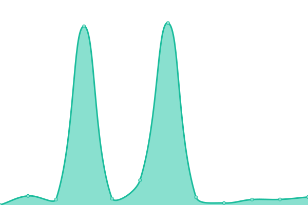

# [📈 Live Status](https://status.giovannigardin.com): <!--live status--> **🟧 Partial outage**

This repository contains the open-source uptime monitor and status page for [Giovanni](https://giovannigardin.com), powered by [Upptime](https://github.com/upptime/upptime).

With [Upptime](https://upptime.js.org), you can get your own unlimited and free uptime monitor and status page, powered entirely by a GitHub repository. We use [Issues](https://github.com/ggardin/uptime-monitor/issues) as incident reports, [Actions](https://github.com/ggardin/uptime-monitor/actions) as uptime monitors, and [Pages](https://status.giovannigardin.com) for the status page.

<!--start: status pages-->
<!-- This summary is generated by Upptime (https://github.com/upptime/upptime) -->
<!-- Do not edit this manually, your changes will be overwritten -->
<!-- prettier-ignore -->
| URL | Status | History | Response Time | Uptime |
| --- | ------ | ------- | ------------- | ------ |
|  [Giovanni Gardin](https://www.giovannigardin.com) | Down | [giovanni-gardin.yml](https://github.com/ggardin/uptime-monitor/commits/HEAD/history/giovanni-gardin.yml) | 

 1501ms
     
 | 

<a href="https://status.giovannigardin.com/history/giovanni-gardin">100.00%</a>
    

|  Ristorante Gelateria All'Angelo Da Lalo | Up | [ristorante-gelateria-all-angelo-da-lalo.yml](https://github.com/ggardin/uptime-monitor/commits/HEAD/history/ristorante-gelateria-all-angelo-da-lalo.yml) | 

 3439ms
     
 | 

<a href="https://status.giovannigardin.com/history/ristorante-gelateria-all-angelo-da-lalo">100.00%</a>
    

|  Life | Up | [life.yml](https://github.com/ggardin/uptime-monitor/commits/HEAD/history/life.yml) | 

 313ms
     
 | 

<a href="https://status.giovannigardin.com/history/life">100.00%</a>
    

|  Barchessa Loredan | Up | [barchessa-loredan.yml](https://github.com/ggardin/uptime-monitor/commits/HEAD/history/barchessa-loredan.yml) | 

 306ms
     
 | 

<a href="https://status.giovannigardin.com/history/barchessa-loredan">100.00%</a>
    

|  Confraternita Vini Asolo Montello | Up | [confraternita-vini-asolo-montello.yml](https://github.com/ggardin/uptime-monitor/commits/HEAD/history/confraternita-vini-asolo-montello.yml) | 

 326ms
     
 | 

<a href="https://status.giovannigardin.com/history/confraternita-vini-asolo-montello">100.00%</a>
    

|  Contemporanea | Up | [contemporanea.yml](https://github.com/ggardin/uptime-monitor/commits/HEAD/history/contemporanea.yml) | 

 745ms
     
 | 

<a href="https://status.giovannigardin.com/history/contemporanea">100.00%</a>
    

|  Contemporanea B2B | Up | [contemporanea-b2-b.yml](https://github.com/ggardin/uptime-monitor/commits/HEAD/history/contemporanea-b2-b.yml) | 

 6324ms
     
 | 

<a href="https://status.giovannigardin.com/history/contemporanea-b2-b">100.00%</a>
    

|  Contemporanea Group | Up | [contemporanea-group.yml](https://github.com/ggardin/uptime-monitor/commits/HEAD/history/contemporanea-group.yml) | 

 4887ms
     
 | 

<a href="https://status.giovannigardin.com/history/contemporanea-group">99.68%</a>
    

|  Montello Country House | Up | [montello-country-house.yml](https://github.com/ggardin/uptime-monitor/commits/HEAD/history/montello-country-house.yml) | 

 384ms
     
 | 

<a href="https://status.giovannigardin.com/history/montello-country-house">100.00%</a>
    

|  ProSetup | Up | [pro-setup.yml](https://github.com/ggardin/uptime-monitor/commits/HEAD/history/pro-setup.yml) | 

 312ms
     
 | 

<a href="https://status.giovannigardin.com/history/pro-setup">100.00%</a>
    

|  UNIPav | Down | [uni-pav.yml](https://github.com/ggardin/uptime-monitor/commits/HEAD/history/uni-pav.yml) | 

 262ms
     
 | 

<a href="https://status.giovannigardin.com/history/uni-pav">100.00%</a>
    

|  Ekphrasis | Up | [ekphrasis.yml](https://github.com/ggardin/uptime-monitor/commits/HEAD/history/ekphrasis.yml) | 

 679ms
     
 | 

<a href="https://status.giovannigardin.com/history/ekphrasis">100.00%</a>
    

|  Itaca Gallery | Up | [itaca-gallery.yml](https://github.com/ggardin/uptime-monitor/commits/HEAD/history/itaca-gallery.yml) | 

 690ms
     
 | 

<a href="https://status.giovannigardin.com/history/itaca-gallery">100.00%</a>
    

|  Punto Infissi | Up | [punto-infissi.yml](https://github.com/ggardin/uptime-monitor/commits/HEAD/history/punto-infissi.yml) | 

 721ms
     
 | 

<a href="https://status.giovannigardin.com/history/punto-infissi">100.00%</a>
    

|  Fabio Favrin portfolio | Down | [fabio-favrin-portfolio.yml](https://github.com/ggardin/uptime-monitor/commits/HEAD/history/fabio-favrin-portfolio.yml) | 

 187ms
     
 | 

<a href="https://status.giovannigardin.com/history/fabio-favrin-portfolio">100.00%</a>
    

<!--end: status pages-->

[**Visit our status website →**](https://status.giovannigardin.com)

## 📄 License

- Powered by: [Upptime](https://github.com/upptime/upptime)
- Code: [MIT](./LICENSE) © [Giovanni](https://giovannigardin.com)
- Data in the `./history` directory: [Open Database License](https://opendatacommons.org/licenses/odbl/1-0/)
